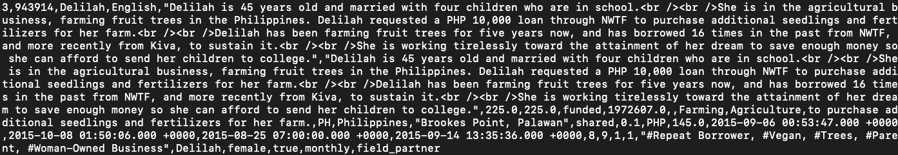
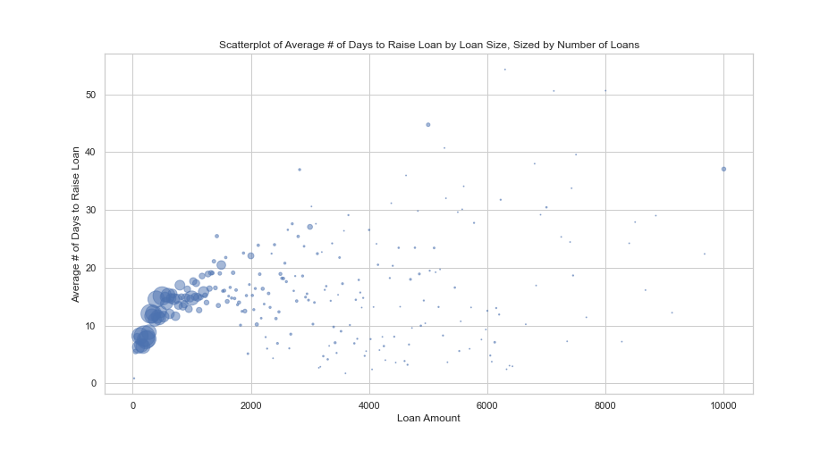
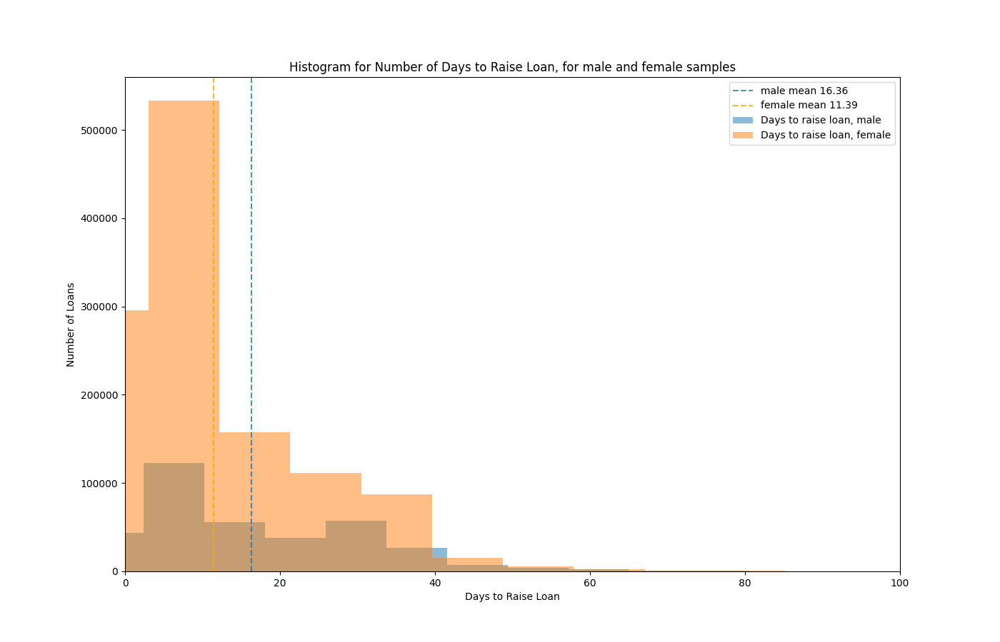

# Kiva Analysis

## Introduction

This project uses exploratory data analysis (EDA) to understand what factors impact how quickly borrowers raise money for microfinance loans. "Microfinance" refers to a system of relatively small loans (typically < $5000 USD), made to individuals or small groups in developing countries to promote entrepreneurship or activity in various economic sectors. This project uses data from Kiva, one of the largest and most open microfinance insitutions to use web-based crowd-funding to finance its loans. On Kiva, borrowers have a web-page describing themselves and what they intend to use the loan for, allowing prospective lenders to lend a portion (or all) of the loan amount requested. Kiva makes available a large number of fields on each loan, and this analysis is interested in understanding what impact gender, loan sector (i.e, agriculture, industry, etc), and geography have on how quickly a loan is raised.

## Data Sources

### Loan Data
Kiva makes available [data snapshots](https://www.kiva.org/build/data-snapshots), archived nightly, featuring historical data on loans in CSV format. This project used data current as of 14 FEB 2021. The loans.csv files takes up 3.45 gigabytes on my local hard disk, and has 1,979,345 rows of data (representing nearly 2 million unique loans).  

Below is a screenshot of a row of raw data. Each record contains 34 fields, that give a rich description of the loan (amount, timing, sector), borrower metadata (location, gender, language), and a text field with the borrower's own description of their aims:

### Purchashing Power Parity 
This project also read in a [csv of data from the World Bank](https://data.worldbank.org/indicator/PA.NUS.PRVT.PP) on Purchasing Power Parity (PPP) across countries to make more meaningful comparisons of loan amounts. In other words, a $500 loan may get you wildly different amounts of goods and services between countries, so multiplying the value of a loan in USD against that country's PPP value for the year of it's loan allows one to compare the value of loans between different countries more meaningfully. 

## Computing
Given the size of the data, the .py script reads in 10k rows of the loans.csv to more more efficiently develop functions and code. I ran the completed script on an AWS EC2 instance using the full loan data set (stored in an S3 bucket). 

## Data Cleaning and Wrangling
Besides the removal of na values and changing string representations of time to datetime objects, the most important wrangling was related to calculated fields, described below (See .py script for additional detail):

* loanspeed_days = calculated as the difference in days (stored as float) between "raised_time" (time when borrower raised 100% of the loan) and "posted_time" (time when loan was posted to Kiva)

* borrower_gender = the original csv had a list of genders for each borrower in the loan; the new column collapses gender to a binary (male,female); loans with mixed gender borrowers were removed. 

* borrower_n = the number of borrowers comprising the loan 

* ppp = the Purchasing Power Parity index for the loan's country and year, based on World Bank Data. If the World Bank dataset did not have the ppp for that exact year, then the closet was found. Countries for which no PPP index existed were removed from the dataset.

* loan_adj = the value of the loand after adjusting for purchasing power parity. This was equal to the value of the loan * ppp (for that country, in that year)

## Data Analysis
While many factors may influence the amount of time it takes for a borrower to raise a loan, this analysis focuses on whether **gender** and **geography** have a significant impact on the amount of time it takes for borrowers to raise a loan. 

First, let's look at some basic descriptives of the amount of time it takes to raise money for a loan before stratifying this variable:

Here's an image, taken from a 10k row sub-sample of the full data set, plotting loan amount against time taken to raise the loan. 

### Gender
A brief look at the histogram for how long it took men vs women to raise their loan shows that: a) the distributions do not appear normal and b) the means appear quite different.  

Therefore, to test the null hypothesis that gender has no bearing on the amount of time it takes borrowers to raise a loan, I used a Mann-Whitney test, with an alpha level of .05, which returned a p-value of 4.326*10^-66 - so we can confidently reject the null hypothesis. As for interpretation, there may be many reasons why women appear to raise loans more quickly than men. It could be that the majority of donors are women, or that female borrowers, ipso facto, are seen as more personally sympathetic than male borrowers, or that female borrowers describe their loans differently than men in ways that are more engaging to borrowers. Many potential explanations are testable and fertile areas for further research. 

### Geography

The full dataset includes 77 countries, so the analysis developed a function to automate the process. The null hypothesis is that geography, interpreted here at the country level, has no bearing on how quickly borrowers from a given country are able to raise loans, with the alternative hypothesis that borrowers from X country are faster or slower than all other countries in raising loans. Here is the process that the analysis took:
*   1. Was country's distribution large enough (minimum 100 records per country)? 
*   2. Was country's distribution normal? (Used Shapiro-Wilks to test for this with an alpha of .01)
    * 2a. If normal, then proceed to independent T-test between Country X and data from all other countries
    * 2b. If not normal, perform Mann-Whitney test between Country X and data from all other countries
*   3. Return the results in a list

Iterating through the set of countries and some Pandas wrangling produces the following table showing size, alpha levels, normality, and significance for each country for the above hypotheses:

![][data/significance_table_output.csv]

